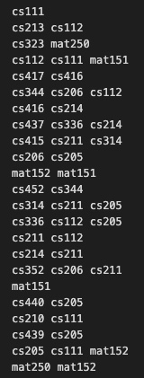
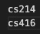

# PreReqChecker
A Java project to create a directed graph of the undergraduate Rutgers CS department course directory.

## Summary
PreReqChecker is comprised of five Java Classes each tasked with responding to specific problems related to navigating the CS course structure. 
- `AdjList.java`
- `ValidPrereq.java`
- `Eligible.java`
- `NeedToTake.java`
- `SchedulePlan.java`

## AdjList
The purpose of this class is to create an Adjacency List and return the dependencies of the course structure. 

Takes two arguments:
- An input file detailing the number of courses related to the department directory
- An output file

returns the full adjacency list structure. 

Implemented the graph using an arraylist of type Course.
  Course stores a string name, and an arraylist of immediate prerequisites. 
 

  
  

## ValidPrereq
The purpose of this class is to use the adjacency list to determine whether a course would be possible to take given a hypothetical prerequisite. 

Takes three arguments:
- An adjlist input file
- A validprereq input file
- An output file

returning YES or NO. 

Implemented using a private class Paths and recusive depth for search method to determine connectivity within the adjacency list. 

  
  
   
  

## Eligible
The purpose of this class is to use the adjacency list and an eligible input file to find what courses are eligible to take.
  The eligible input file is a list of completed courses, and it is assumed that they have been taken and all direct and indirect prerequisites have been taken.

Takes three arguments:
- An adjlist input file
- A eligible input file
- An output file

returns the course ID (name) of the courses eligible to take. 
 

  
  

## NeedToTake
The purpose of this class is given a list of completed courses, find the courses required to reach a target course. 

Takes three arguments:
- An adjlist input file
- A needtotake input file
- An output file

returns the course ID of the courses required to reach target. 
 

  
  

## How to Run

All java files in `src` must be compiled.

