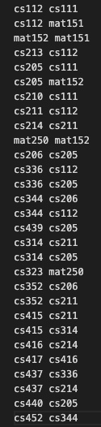

# PreReqChecker
A Java project to create a directed graph of the undergraduate Rutgers CS department course directory.

## Summary
PreReqChecker is comprised of five Java Classes each tasked with responding to specific problems related to navigating the CS course structure. 
- `AdjList.java`
- `ValidPrereq.java`
- `Eligible.java`
- `NeedToTake.java`
- `SchedulePlan.java`

## AdjList
The purpose of this class is to create an Adjacency List and return the dependencies of the course structure. 

Takes two arguments:
- An input file detailing the number of courses related to the department directory
- An output file

Implemented the graph using an arraylist of type Course.
  Course stores a string name, and an arraylist of immediate prerequisites. 
 

  
  

## ValidPrereq
The purpose of this class is to use the adjacency list to determine whether a course would be possible to take given a hypothetical prerequisite. 

## How to Run

All java files in `src` must be compiled.

